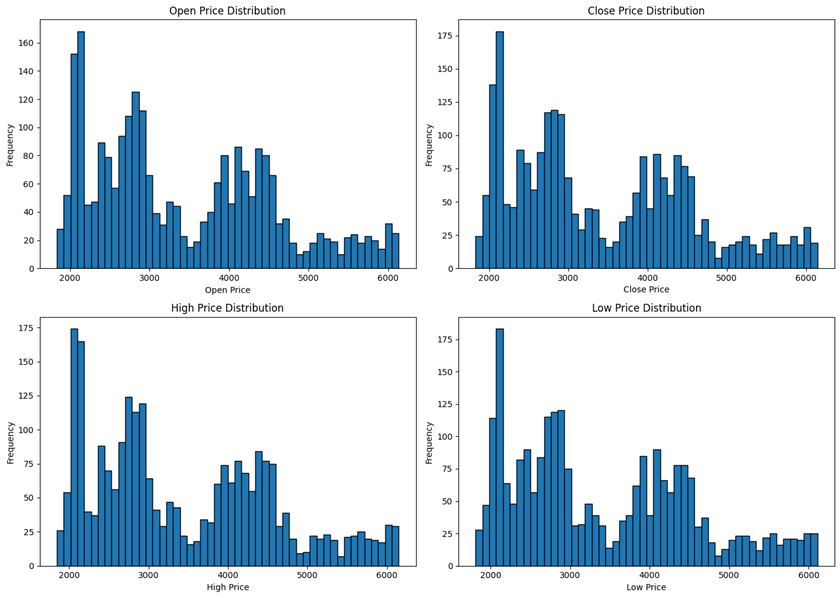
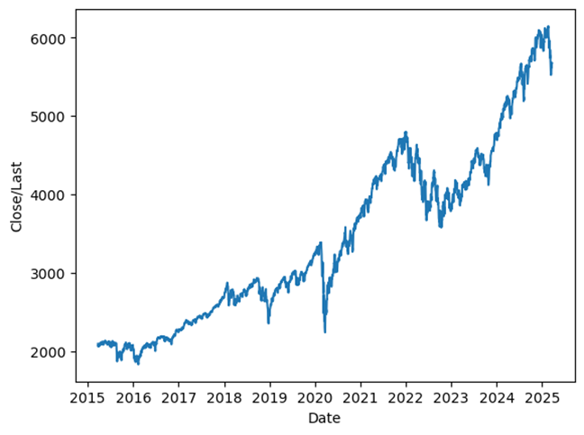
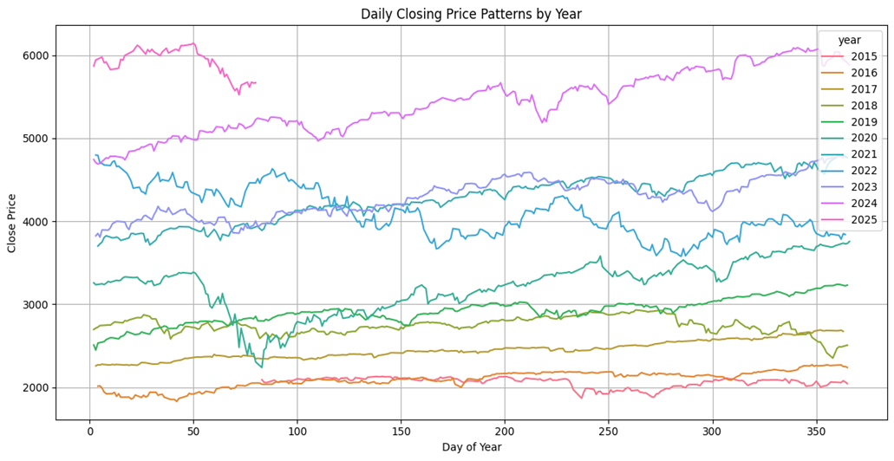
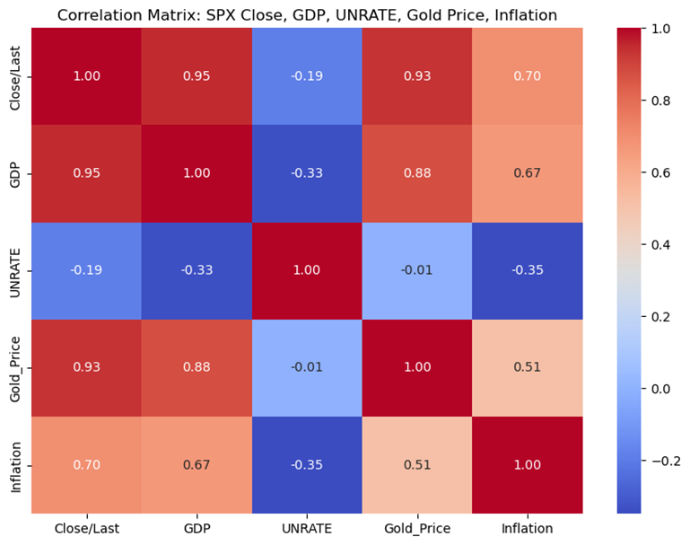

# 2025_ia651_tangirala_pammi
### ABSTRACT
This project forecasts S&P 500 closing prices using historical data and advanced models. After classical methods like ARIMA underperformed, our approach shifted to RNN , XG Boost and LSTM, leveraging lag features of the Close price. Evaluated with MSE, MAE, RMSE  the models provide insights into market trends while addressing challenges like volatility and overfitting. Future enhancements include adding macroeconomic data and automated retraining for real-time forecasting.

### DATASET
#### Describe the dataset(s) used.  
•	NASDAQ:
 S & P 500 [DATE, CLOSE, OPEN, HIGH, LOW], 
GOLD PRICE [DATE, CLOSE, VOLUME, OPEN, HIGH,  LOW]

•	FRED: UNEMPLOYEMENT RATE, INFLATION 

#### Describe the fields, possibly where the dataset originates, how it was collected, and why it might be useful especially if it is not obvious.  

•	The dataset is valuable for identifying market trends, as the Close price reflects investor sentiment and trading outcomes. 
•	While additional macroeconomic data (GDP, Unemployment, Gold Prices, Inflation) was analyzed for correlation, the final model focused solely on price history for forecasting
### PREDICTION OBJECTIVE
•	The goal is to predict future S&P 500 closing prices based on historical Close values.

•	This forecast can assist investors and analysts in anticipating market movements, supporting strategic decision-making in portfolio management, risk assessment, and trading operations.

### PROCESS OVERVIEW
•	The project began with collecting 10 years of S&P 500 daily price data. 

•	Initial modeling involved classical time series methods like Naive Forecast, Holt-Winters, and ARIMA. 

•	After identifying limitations in handling market volatility and non-linear patterns, the approach shifted to machine learning models, specifically XG Boost and LSTM.

•	Feature engineering focused on creating lag features from the Close price. Models were evaluated using regression metrics, ensuring proper train/test splits to avoid data leakage.

### EDA

#### What are your X and Y variables? 
•	  X Variables:
#### past values of close price and date  
•	  Y Variable:
The next period’s Close price (target for forecasting).   
#### Classification or regression?  
•	Regression — Predicting continuous S&P 500 closing prices   
#### How many observations?  
•	2,521 daily records before cleaning the S&P 500 dataset.  
•	2,515 daily records after cleaning the S&P 500 dataset.  
#### Features to observations?  
•	4 features to 2521 observations  
#### Correlation - are some features strongly correlated?  

 

•	Features within the data were highly correlated so we looked at other exogenous data for any correlation   
•	GDP (0.95):   
A strong positive correlation indicates that as GDP grows, the S&P 500 index tends to rise, reflecting the close link between economic expansion and market performance.   
•	Gold Price (0.93):  
Surprisingly, there is also a strong positive correlation with gold prices. While gold is traditionally seen as a hedge, during certain   periods, both equities and gold can rise due to liquidity or inflation expectations.  
•	Inflation (0.70):  
A moderate positive correlation suggests that inflationary periods may coincide with rising stock prices, possibly driven by nominal growth factors or market adjustments to inflation expectations.  
•	Unemployment Rate (-0.19):  
A weak negative correlation, which aligns with economic theory—higher unemployment generally signals weaker economic conditions, potentially leading to lower market performance.  

### FEATURE IMPORTANCE  
#### If not, make a case for the feature selection you used.  
•	The model uses only the Closing Price as it is the most reliable indicator of market , reflecting the final outcome of daily trading.  
•	The Date is utilized solely to maintain temporal order, enabling accurate time series forecasting without introducing redundant features.  

### FEATURE ENGINEERING  
•	Data Cleaning: Removed rows where price values were zero.  
•	Resampling: Aggregated daily data to monthly averages for smoother long-term trend analysis.  
•	Scaling: Applied for models sensitive to feature magnitude, such as LSTM or linear models.  

### MODEL FITTING  

#### Train/Test Split:  
•	(Classical models): Split using random date where prior data is training and the rest is testing data.  
•	(Advanced models)  A chronological split was applied, using 80% for training and 20% for testing to preserve time order and prevent look-ahead bias, which is critical in time series forecasting.  
 
### Data Leakage Risk:  
•	Since time series data is sequential, random splitting was avoided to eliminate data leakage. All models were trained strictly on past data to predict future values.  
Models Selected:  
•	Started with classical models like Naive Forecast, Holt-Winters, and ARIMA for baseline comparisons.   
•	Due to their limitations in capturing non-linear patterns, the approach shifted to XGBoost for its ability to handle complex relationships and LSTM for deep learning-based sequence modeling.  
Model Selection Thought Process:  
•	Classical models were chosen for simplicity and interpretability. Machine learning models were introduced to improve performance on volatile, non-linear  behavior.  
Hyperparameter Tuning:  
•	For XGBoost, parameters like n_estimators, max_depth, and learning_rate.  
•	For LSTM, applied early stopping and adjusted epochs, batch size, and neuron counts to avoid overfitting.  

### VALIDATION/METRICS  
Which metrics did you weigh most heavily, why?  
•	MAE, MSE, RMSE  
Give 2-4 prediction examples from your data.  
   

Give 2 prediction examples which are new or synthesized.   
   

### OVERFITTING/UNDERFITTING  
Model Behavior:  
•	Classical models like Naive and ARIMA showed signs of underfitting, unable to capture market volatility.  
•	XGBoost and LSTM initially showed overfitting, performing well on training data but less accurately on unseen data.  
Mitigation Techniques:  
•	For XGBoost: Tuned max_depth, reduced learning_rate, and applied early stopping.  
•	For LSTM: Used dropout layers, early stopping, and limited epochs to control overfitting.  
•	Ensured proper time-based train/test split to avoid data leakage.  

### PRODUCTION CONSIDERATIONS  
Deployment Advice:  
•	Deploy as part of an automated pipeline using frameworks like Flask or Fast API to serve forecasts.   
•	Set up regular updates with new closing price data for continuous predictions.  
Precautions:  
•	The model cannot predict sudden market shocks (e.g., geopolitical events, economic crises).  
•	Requires periodic retraining to adapt to changing market conditions.  

### GOING FURTHER  
Improving the model could involve adding more historical or intraday data, integrating macroeconomic and technical indicators, and exploring advanced models like hybrid approaches .  

### ACKNOWLEDGEMENT  
This project was completed as part of the IA651: Applied Machine Learning course at Clarkson University, under the guidance of Professor Michael Gilbert.  
